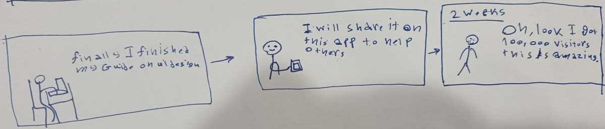
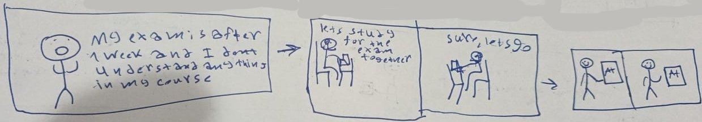
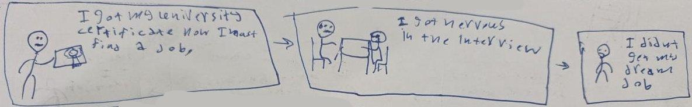

# Stage 1: Team Formation and Idea Development Report
## Team
- Abdulaziz Almutairi
- Ismail Rowaihy
- Sara Ali Mareer
- Farah Almozaini

## Ideas Explored
### A Social Platform to Share Good Resources With Others
**Problem:**   
As an educational website creator, it is hard for me to share my website on the internet without needing to learn concepts like SEO or social marketing to promote my website.

**Solution:**   
By making a social platform to share good resources, people can share their own resources or the good resources they find on the internet, which makes it easier for educational website creators to promote their content.

**Strengths:**
- Educational content creators can achieve more visitors.
- Learners can find high-quality learning websites with less effort.

**Weaknesses:**
- It can also share more low-quality content.

**Rejection Reason:** It is possible to share educational content on other platforms too, so it doesn’t look like we have made something new.

### Startup Launch Manager for Beginners
**Problem:**   
As an entrepreneur who has thought of a good and great startup idea, I lose interest in my idea after knowing how hard it is for me to create plans for my idea.

**Solution:**   
By making a startup management system, entrepreneurs can now create plans and manage tasks much more easily and thus make it easier for them to execute their ideas.

**Strengths:**
- Entrepreneurs can plan their ideas with less effort.
- Entrepreneurs can distribute their tasks with less effort.

**Weaknesses:**
- There are more things that make executing a startup harder, which we don’t think we can solve with this idea.

**Rejection Reason:** We don’t have enough experience in startups in our team, so we don’t think that we are capable of working on this idea.

### Social Platform for Creating Learning Groups
**Problem:**   
As a student who has an upcoming exam in a hard course, it is hard for me to study and understand the material by myself.

**Solution:**   
By making a social platform for creating learning groups, students can pass their exams with less effort and get higher marks by helping each other study.

**Strengths:**
- Students can study with the help of each other.
- Students can share valuable materials with each other.

**Weaknesses:**
- Bad actors might distract the communities by sharing bad content.

**Rejection Reason:** For this idea to be effective, we need a lot of users in multiple universities so students can find someone to study with.

### A Story Game
**Problem:**   
As a university graduate, I have low experience in job search.

**Solution:**   
By making a story game about a graduate’s job search journey, new graduates can reduce their anxiety in job search and learn useful techniques that can help them find their dream job.

**Strengths:**
- It is easier to learn from a game than reading a 500-page book.
- It is easy to implement the game.

**Weaknesses:**
- We need to interview other people with the same experience to gain material for the game story.

**Selection Reason:** The idea makes a high benefit for a lot of people, and also it is easy to implement.

## Selected MVP Concept
We choose to make a story game about a graduate who is going to find his first job because of how beneficial it is and how it shows our skills in UI/UX and data analysis of qualitative data to gain material for the story.

### Planned MVP
We plan to make:
- Multiple paths of the story so the player can explore different possibilities
- Small puzzles during the game so the player can engage more in the game
- A player performance report that can be saved on the player's account
- An interviewer bot that chooses the hardest questions for the player based on his responses

### Potential Challenges
We might face the following challenges during the implementation of this idea:
- Lack of material to research for the story
- Difficulties in designing the game characters
- Difficulties in designing the game animations

However, we are confident in our ability to overcome these challenges as we have talents in UI/UX, data analysis, game development, and software engineering in our team.

