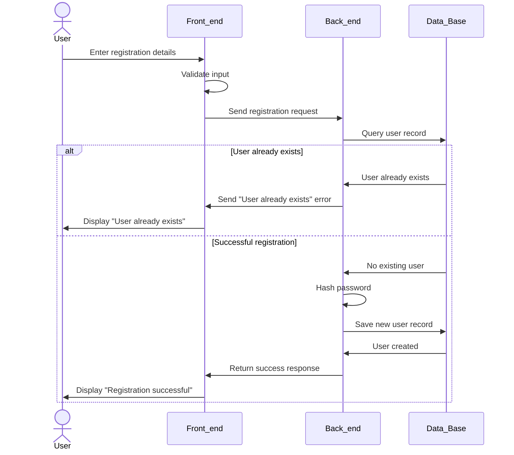

# Atrab Project Technical Documentation

## User Stories and Mockups

### User stories
#### Must have
- As a Student I want to access every message by its group so that I can find important messages
- As a Student I want to write messages in the group so that I can communicate with my peers
- As a Student I want to Share a Resource with my peers so that I Help my peers with There Study
- As a Student I want to Rate resources so that good resources appear higher in the search results
- As a Student I want to view relevant messages in the group so that I don't see repeated spam messages and ads in the group
- As a User I want to Link multiple emails to my account so that can join multiple private groups from deferent university
- As a Admin I want Users emails to be verified so that I can trust there email ownership
- As a Group administrator I want to restrict group access for student with access to emails with specific domains so that I keep the group access private for students of this email domain
- As a User I want to log in using my email and password so that I can access my account.
- As a User I want to register so that I can create an account.
- As an admin I want to create and publish new courses so that learners can access updated content.
#### Should have
- As a Student I want to Browse all university groups so that I can Find my university's group.
- As a Student I want to Search for groupes by name or keyword so that I can Quickly find the group I am looking for.
- As a Student I want to Download course resources so that I can use them while practicing for my exam.
#### Could Have
- As a Student I want to save a group to my favorites so that I can return to it easily anytime.
#### Won't have
- As a Student I want to watch lessons in a short and clear format so that I can learn without spending too much time.
- As a Student I want to see my progress in each course so that I know how much I have completed.
- As a Student I want to rate the course after finishing it so that I can provide helpful feedback.
- As a Student I want to receive a certificate after completing a course so that I can use it in my professional profile.
- As an Admin I want to manage learner accounts so that I can provide support when needed.

### Mockups

Landing Page (Home Page)

This page introduces the platform and explains the main features in a simple and friendly way.
It helps students quickly understand what the community offers.

The page includes:
-Live Discussions: A space for students to ask questions and talk about their courses.
-Resource Sharing: Uploading notes, summaries, and study materials.
-Student Community: Connecting with classmates in the same major.
-There is also a clear button to start the journey by choosing the student’s institution.

Institutions Page

This page helps students find and select their university or college.
Once the student chooses an institution, the platform becomes personalized for them.

The page contains:
-A search bar to look for the institution
-A clean list of universities with location and number of students
-Simple card design that makes browsing easy and organized

This page acts as a complete communication hub for students inside the same university.
It allows them to:
-Explore their colleges
-Join trending conversations
-Connect with others
-Share questions and advice easily

This page acts as a complete community hub for the college, helping students:
-Explore their courses
-Access useful resources
-Join public discussions
-Connect with classmates in the same major
A simple, interactive, and organized space just for their academic community.


The page serves as a welcoming introduction to Atrab, showing the platform’s identity, goals, and values while introducing the team behind it.
It helps students understand the purpose of the platform and encourages them to join the community.

## System Architecture
<details>
  <summary>System Architecture Diagram</summary>

  ```mermaid
architecture-beta
    group proxy(server)[System]

    group webfrontend(server)[Web Frontend] in proxy
    group appwrite(server)[Appwrite] in proxy
    group spamdetctionmodel(server)[Spam Detection Model] in proxy
    group core(server)[Backend] in proxy

    %% Web Frontend Services
    service vuejs(server)[Vue JS] in webfrontend
    service vite(server)[Vite] in webfrontend

    vite:R --> L:vuejs

    %% vuejs:R --> L:bfuncs
    %% vuejs:R --> L:db
    %% vuejs:R --> L:vstore
    %% vuejs:R --> L:istore
    %% vuejs:R --> L:astore
    %% vuejs:R --> L:auth

    vuejs:R --> L:utilsa
    
    vuejs:R --> L:mapi

    %% Appwrite services
    service bfuncs(server)[Business Functions] in appwrite
    service db(database)[Database] in appwrite
    service vstore(disk)[Video Storage] in appwrite
    service astore(disk)[Audio Storage] in appwrite
    service istore(disk)[Image Storage] in appwrite
    service auth(server)[Authentication] in appwrite
    service messages(server)[Email Verification] in appwrite

    bfuncs:R --> L:utilsa
    auth:R --> L:messages
    %% Spam Detection Model
    service mapi(server)[FastAPI] in spamdetctionmodel
    service model(server)[Model] in spamdetctionmodel

    mapi:R --> L:model
    model:R --> L:utilsa

    %% Functional Core
    service utils(server)[Functional Core] in core
    service utilsa(server)[FastAPI] in core

    utilsa:R --> L:utils 
```
</details>
Our architecture leverages Appwrite as the backend platform, with domain logic encapsulated in a dedicated functional core to enhance maintainability and test coverage. The frontend is implemented using Vue.js and served via Vite. All internal services operate within a private network and communicate privately, while user access is routed securely through an Nginx reverse proxy.

## Components, Classes, and Database Design
<details>
  <summary>Class Diagram</summary>
  
  ```mermaid
  classDiagram
    class User {
        -id: string
        +name: string
        -email: string
        -passwordHash: string
        -isAdmin: bool
        -universityEmails: string[]
        -createdAt: DateTime

        +addUniversityEmail(email: string): void
        +removeUniversityEmail(email: string): void
        +updateProfile(User: User): void
    }


    class EducationOrganization {
        -id: string
        +name: string
        -EmailDomain: string
        -createdAt: DateTime
        +chat: Chat 
        +users: User[]
        -bannedUsers: User[]

        +validateEmail(email: string): bool
        +banUser(userId: string): void
    }

    class Group {
        -id: string
        +name: string
        +description: string
        +chat: Chat
        +users: User[]
        -admins: User[]
        +resources: Resource[]
        +groups: Group[]

        +addMember(user: User): void
        +kickMember(user: User): void
    }
    
    class Resource {
        -id: string
        +title: string
        +description: string
        +resourcetype: string
        +location: string
        +voteScore: int
        -voters: UserId[]
        +uploadedBy: User
        +createdAt: DateTime

        +vote(userId: string, isUpvote: bool): void
        +delete(): void
    }
    
    class Chat {
        -id: string
        +title: string
        +createdAt: DateTime
        +messages: Messages[]

        +addMessage(message: Message): void
    }
    
    class Message {
        -id: string
        -ChatId: string
        +senderUser: User
        +content: string
        +isEdited: bool
        +createdAt: DateTime
        +reacts: emojis []

        +editContent(newContent: string): void
        +delete(): void
        +react(emoji: string, userId: string): void
        +replyTo(messageId: string): void
    }


    EducationOrganization "1" --> "*" User : members
    EducationOrganization "1" --> "*" Group : contains
    EducationOrganization --> "1" Chat : general channel

    Group "0" --> "*" Resource : could have
    Group "1"--> "*" User : members
    Group --> "1" Chat : contains
    Group "0"--> "*" Group : sub-groups
    Resource --> "1" User : uploader
    Chat "1" *-- "*" Message : contains
    Message --> "1" User : sender
  ```
</details>

<details>
  <summary>ER Diagram</summary>
  
</details>

## High-Level Sequence Diagrams

<details>
  <summary>Login flow sequence diagram</summary>

  ```mermaid
sequenceDiagram
    actor User
    participant Front_end
    participant Back_end
    participant Data_Base
    

    User->>Front_end: Enter login details
    Front_end->>Front_end: Validate input format
    Front_end->>Back_end: Send login request
    Back_end->>Data_Base: Query user record


    alt User not found
        Data_Base->>Back_end: User not found
        Back_end->>Front_end: Send error message
        Front_end->>User: Display "User not found"
    else Wrong password
        Data_Base->>Back_end: User record found
        Back_end->>Back_end: Verify password hash
        Back_end->>Front_end: Invalid Password
        Front_end->>User: Display "Wrong password"
    else Successful login
        Back_end->>Back_end: Authentication successful
        Back_end->>Back_end: Generate session token
        Back_end->>Front_end: Return success with token
        Front_end->>Front_end: Set auth cookies
        Front_end->>User: Redirect to main page
    end
```
</details>


<details>
  <summary>Registration sequence diagram</summary>


</details>

<details>
  <summary>Sending a massage sequence diagram</summary>

  ```mermaid
sequenceDiagram
    actor User
    participant Front_end
    participant Back_end
    participant Spam_Detection_Model
    participant Data_Base

    User->>Front_end: Type message and press "Send"
    Front_end->>Front_end: Basic input check
    Front_end->>Back_end: Send "Create Message" request

    Back_end->>Spam_Detection_Model: Checks Massage
    alt is Spam
      Spam_Detection_Model->>Back_end: Massage is Spam
      Back_end->>Front_end: Error "Spam Detected"
      Front_end->>User: Error "Spam Detected"
    else not Spam
      Spam_Detection_Model->>Back_end: massage not Spam
      Back_end->>Data_Base: Save new message
      Data_Base->>Back_end: Message saved
      Back_end->>Front_end: Success + message data
      Front_end->>User: Show message in chat
    end
  ```
</details>

## External APIs

The system does not utilize any external APIs.

## Internal APIs

The system consists of two internal APIs: one for the backend and another for the spam detection model. This separation ensures that each component can be developed and maintained independently, as neither component depends directly on the other.


### Backend API

The backend exposes the following routes:

1. **GET /users**  
   Returns an array of all users.

2. **GET /users/{id:int}**  
   Returns information for the user with the specified ID.

3. **POST /users**  
   Accepts new user data in JSON format and returns the newly created user.

4. **DELETE /users/{id}**  
   Deletes the user associated with the given ID.

5. **GET /groups**  
   Returns an array of all registered groups.

6. **GET /groups/{id:int}**  
   Returns information for the group with the specified ID.

7. **POST /groups**  
   Accepts new group data in JSON format and returns the newly created group.

8. **DELETE /groups/{id}**  
   Deletes the group associated with the given ID.

9. **GET /groups/{gid}/resources**  
   Returns an array of resources belonging to the specified group.

10. **GET /groups/{gid}/resources/{rid}**  
    Returns information for the resource with the given resource ID in the specified group.

11. **POST /groups/{gid}/resources**  
    Accepts new resource data in JSON format and returns the newly created resource.

12. **DELETE /groups/{gid}/resources/{rid}**  
    Deletes the resource with the given resource ID from the specified group.


### Spam Detection Model API

The spam detection model exposes the following route:

1. **GET /spam/detect**  
   Accepts a JSON object containing the message content and returns a boolean value indicating whether the message is classified as spam.

## Source Control Management and Quality Assurance Strategies

The project utilizes Git as the primary source control management system, with the codebase hosted on GitHub. Project tasks and progress are managed through GitHub Projects.

To maintain code quality, preserve a clear commit history, and prevent unintended changes, direct pushes to the `master` branch are strictly prohibited. All modifications must be introduced through pull requests, each of which must be reviewed by at least one team member prior to merging to ensure correctness and adherence to project standards.

An automated GitHub workflow is triggered for every pull request. This workflow performs the following checks:

- Code formatting compliance with the project’s style guide  
- Compilation errors  
- Linting issues  
- Verification that the project remains compilable if the changes are merged  

Additionally, GitHub Copilot will automatically generate a summary comment for each pull request. This summary provides an overview of the contributor’s work and suggests optional improvements.

