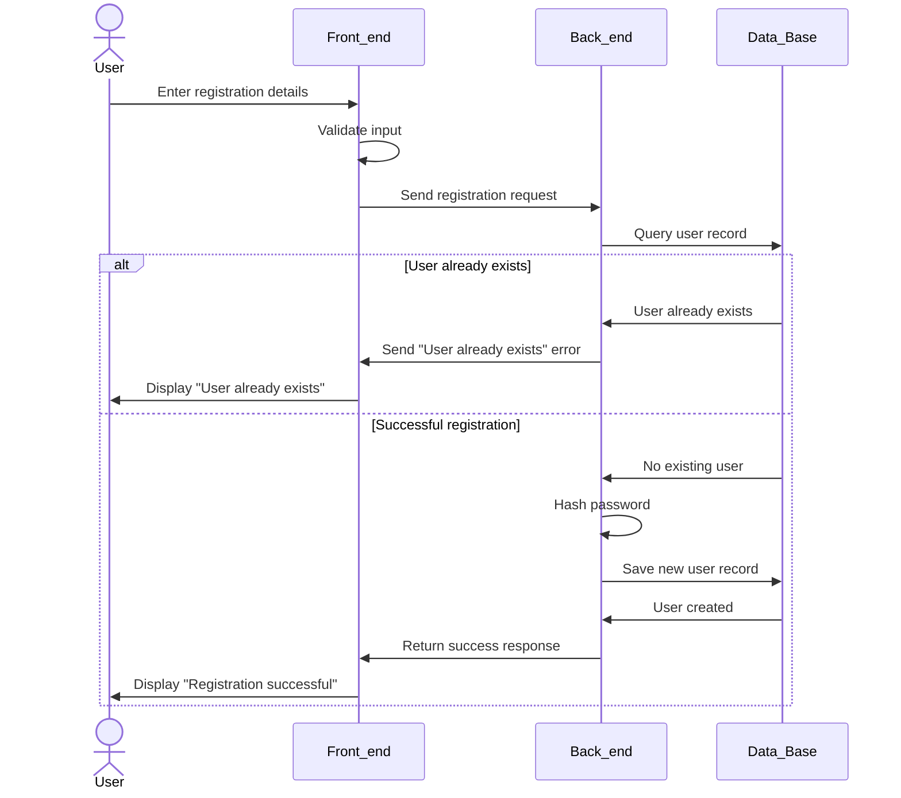

# Atrab Project Technical Documentation

## User Stories and Mockups

### User stories
#### Must have
- As a Student I want to access every message by its group so that I can find important messages
- As a Student I want to write messages in the group so that I can communicate with my peers
- As a Student I want to Share a Resource with my peers so that I Help my peers with There Study
- As a Student I want to Rate resources so that good resources appear higher in the search results
- As a Student I want to view relevant messages in the group so that I don't see spam messages and ads in the group
- As a User I want to Link multiple emails to my account so that can join multiple private groups from deferent university
- As a Admin I want Users emails to be verified so that i can trust there email ownership
- As a Group administrator I want to restrict group access for student with access to emails with specific domains so that I keep the group access private for students of this email domain
#### Should have
#### Could Have
#### Won't have

### Mockups


## System Architecture
<details>
  <summary>System Architecture Diagram</summary>

  ```mermaid
architecture-beta
    group proxy(server)[System]

    group webfrontend(server)[Web Frontend] in proxy
    group appwrite(server)[Appwrite] in proxy
    group spamdetctionmodel(server)[Spam Detection Model] in proxy
    group core(server)[Functional Core] in proxy

    %% Web Frontend Services
    service vuejs(server)[Vue JS] in webfrontend
    service vite(server)[Vite] in webfrontend

    vite:R --> L:vuejs

    vuejs:R --> L:bfuncs
    vuejs:R --> L:db
    vuejs:R --> L:vstore
    vuejs:R --> L:istore
    vuejs:R --> L:astore
    vuejs:R --> L:auth

    vuejs:R --> L:utils
    
    vuejs:R --> L:mapi

    %% Appwrite services
    service bfuncs(server)[Business Functions] in appwrite
    service db(database)[Database] in appwrite
    service vstore(disk)[Video Storage] in appwrite
    service astore(disk)[Audio Storage] in appwrite
    service istore(disk)[Image Storage] in appwrite
    service auth(server)[Authentication] in appwrite
    service messages(server)[Email Verification] in appwrite

    bfuncs:R --> L: utils
    auth:R --> L:messages
    %% Spam Detection Model
    service mapi(server)[FastAPI] in spamdetctionmodel
    service model(server)[Model] in spamdetctionmodel

    mapi:R --> L:model
    model:R --> L:utils

    %% Functional Core
    service utils(server)[Utilities] in core
```
</details>
Our architecture leverages Appwrite as the backend platform, with domain logic encapsulated in a dedicated functional core to enhance maintainability and test coverage. The frontend is implemented using Vue.js and served via Vite. All internal services operate within a private network and communicate privately, while user access is routed securely through an Nginx reverse proxy.

## Components, Classes, and Database Design
<details>
  <summary>Class Diagram</summary>
  
  ```mermaid
  classDiagram
    class User {
        -id: string
        +name: string
        -email: string
        -passwordHash: string
        -isAdmin: bool
        -universityEmails: string[]
        -createdAt: DateTime

        +addUniversityEmail(email: string): void
        +removeUniversityEmail(email: string): void
        +updateProfile(User: User): void
    }


    class EducationOrganization {
        -id: string
        +name: string
        -EmailDomain: string
        -createdAt: DateTime
        +chat: Chat 
        +users: User[]
        -bannedUsers: User[]

        +validateEmail(email: string): bool
        +banUser(userId: string): void
    }

    class Group {
        -id: string
        +name: string
        +description: string
        +chat: Chat
        +users: User[]
        -admins: User[]
        +resources: Resource[]
        +groups: Group[]

        +addMember(user: User): void
        +kickMember(user: User): void
    }
    
    class Resource {
        -id: string
        +title: string
        +description: string
        +resourcetype: string
        +location: string
        +voteScore: int
        -voters: UserId[]
        +uploadedBy: User
        +createdAt: DateTime

        +vote(userId: string, isUpvote: bool): void
        +delete(): void
    }
    
    class Chat {
        -id: string
        +title: string
        +createdAt: DateTime
        +messages: Messages[]

        +addMessage(message: Message): void
    }
    
    class Message {
        -id: string
        -ChatId: string
        +senderUser: User
        +content: string
        +isEdited: bool
        +createdAt: DateTime
        +reacts: emojis []

        +editContent(newContent: string): void
        +delete(): void
        +react(emoji: string, userId: string): void
        +replyTo(messageId: string): void
    }


    EducationOrganization "1" --> "*" User : members
    EducationOrganization "1" --> "*" Group : contains
    EducationOrganization --> "1" Chat : general channel

    Group "0" --> "*" Resource : could have
    Group "1"--> "*" User : members
    Group --> "1" Chat : contains
    Group "0"--> "*" Group : sub-groups
    Resource --> "1" User : uploader
    Chat "1" *-- "*" Message : contains
    Message --> "1" User : sender
  ```
</details>

<details>
  <summary>ER Diagram</summary>
  
</details>

## High-Level Sequence Diagrams

<details>
  <summary>Login flow sequence diagram</summary>

  ```mermaid
sequenceDiagram
    actor User
    participant Front_end
    participant Back_end
    participant Data_Base
    

    User->>Front_end: Enter login details
    Front_end->>Front_end: Validate input format
    Front_end->>Back_end: Send login request
    Back_end->>Data_Base: Query user record


    alt User not found
        Data_Base->>Back_end: User not found
        Back_end->>Front_end: Send error message
        Front_end->>User: Display "User not found"
    else Wrong password
        Data_Base->>Back_end: User record found
        Back_end->>Back_end: Verify password hash
        Back_end->>Front_end: Invalid Password
        Front_end->>User: Display "Wrong password"
    else Successful login
        Back_end->>Back_end: Authentication successful
        Back_end->>Back_end: Generate session token
        Back_end->>Front_end: Return success with token
        Front_end->>Front_end: Set auth cookies
        Front_end->>User: Redirect to main page
    end
```
</details>


<details>
  <summary>Registration sequence diagram</summary>


</details>

## External and Internal APIs


## SCM and QA Strategies
